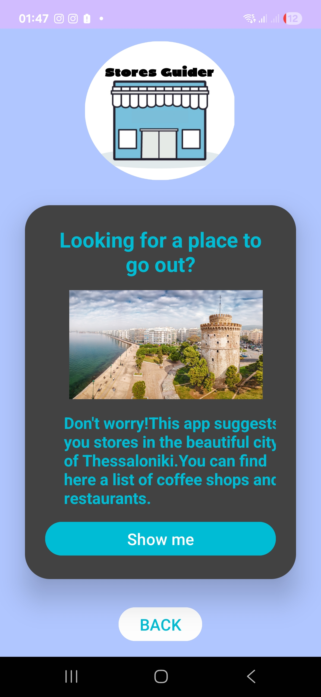
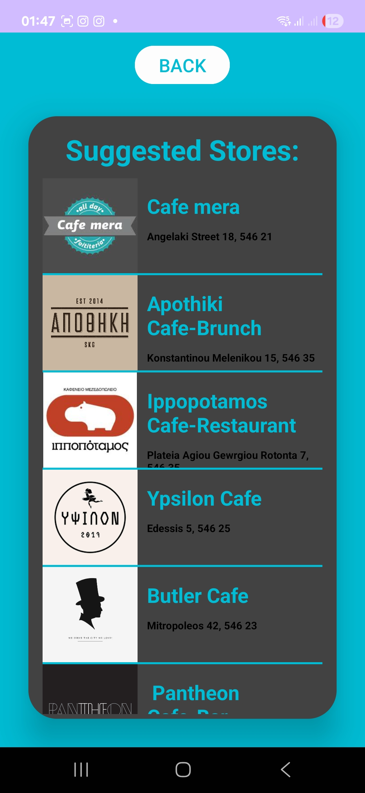

## Stores Guider App

**Stores Guider** is a mobile application that showcases a curated list of dining spots in Thessaloniki, Greece. It is designed for visitors, tourists, and locals alike who want quick and easy access to quality food recommendations—personally selected and tested by the app's developers. This app was developed as part of an academic mobile app development course.

The purpose of the app is to centralize these recommendations in one place, avoiding the common issue of forgetting or losing food suggestions seen in social media posts or videos.

### 🔍 Key Features
- User registration and login system with local database support.
- Clean and intuitive UI with welcome screens and navigation.
- List view showing selected stores with logo, name, and address.
- Only the app developers can add or modify the listed stores, ensuring quality control.
- Future plans include integration with a social media account showcasing visits to the featured places.

## 📱 Screenshots

  
  

## 📦 APK Download

You can download the app and install it on your Android device:

➡️ [Download app-debug.apk](app-debug.apk)

